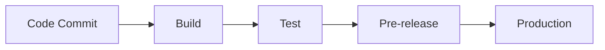

# LastPro - MLOps Project

A comprehensive MLOps project demonstrating **version control**, **Docker containerization**, **CI/CD pipelines**, **automated deployment workflows**, **data versioning with DVC**, and **ML experiment tracking with MLflow**.

## 🚀 Project Overview

This project implements a complete MLOps pipeline for machine learning model development, featuring automated workflows from code commit to production deployment. The project showcases best practices in DevOps and MLOps methodologies.

## 📁 Project Structure

```
LastPro/
├── ml/                          # Machine Learning Pipeline
│   ├── train_with_mlops.py     # Main training script with MLflow integration
│   ├── create_data_versions.py # Data versioning script
│   ├── README_experiments.md   # Experiment documentation
│   └── README_data.md          # Data documentation
├── src/                         # Application Source Code
│   └── app.py                  # Main application
├── data/                        # Data Directory (DVC managed)
│   ├── train_and_test2.csv     # Original dataset
│   ├── train_and_test2_v1.csv # Version 1 (basic preprocessing)
│   └── train_and_test2_v2.csv # Version 2 (enhanced preprocessing)
├── tests/                       # Test Suite
│   └── test_app.py             # Unit tests
├── .github/workflows/           # CI/CD Pipeline Configuration
│   └── main.yml                # GitHub Actions workflow
├── Dockerfile                   # Docker containerization
├── docker-compose.yml          # Docker orchestration
├── requirements.txt            # Python dependencies
└── README.md                   # This file
```

## 🔄 Version Control & Branch Strategy

### Git Branch Management
- **`main`**: Production-ready code
- **`dev`**: Development branch for active development
- **`feature/*`**: Feature branches for new functionality
- **`hotfix/*`**: Critical bug fixes

### Version Control Features
- **Code Versioning**: Git tracks all code changes with commit hashes
- **Data Versioning**: DVC manages dataset versions and tracks data lineage
- **Model Versioning**: MLflow tracks model versions and experiment runs
- **Configuration Versioning**: All configuration files are version controlled

## 🐳 Docker Containerization

### Containerization Strategy
The project uses Docker for consistent deployment across environments:

```dockerfile
# Multi-stage build for optimization
FROM python:3.9-slim
WORKDIR /app
COPY requirements.txt .
RUN pip install --no-cache-dir -r requirements.txt
COPY . .
CMD ["python", "ml/train_with_mlops.py"]
```

### Docker Benefits
- **Consistency**: Same environment across development, testing, and production
- **Isolation**: Isolated dependencies and runtime environment
- **Scalability**: Easy horizontal scaling with container orchestration
- **Portability**: Run anywhere Docker is supported

## 🔧 CI/CD Pipeline Architecture

### Automated Deployment Workflow

The project implements a comprehensive CI/CD pipeline that automates the entire ML workflow:

#### 1. **Code Commit** → **Build** → **Test** → **Pre-release** → **Production**



#### 2. **Branch-Triggered Pipelines**

| Branch | Trigger | Pipeline Actions |
|--------|---------|------------------|
| `main` | Push/Merge | Full pipeline: Build → Test → Deploy to Production |
| `dev` | Push | Build → Test → Deploy to Staging |
| `feature/*` | Push | Build → Test → Code Quality Checks |
| `hotfix/*` | Push | Fast-track: Build → Test → Deploy to Production |

#### 3. **Pipeline Stages**

**Stage 1: Build**
- Install dependencies
- Build Docker image
- Run static code analysis

**Stage 2: Test**
- Unit tests execution
- Integration tests
- Code coverage analysis
- Data validation tests

**Stage 3: Pre-release (Staging)**
- Deploy to staging environment
- Run end-to-end tests
- Performance testing
- Security scanning

**Stage 4: Production**
- Deploy to production environment
- Health checks
- Monitoring setup
- Rollback capability

## 📊 Data Version Management (DVC)

### DVC Integration
Data Version Control (DVC) manages dataset versions and ensures reproducibility:

```bash
# Initialize DVC
dvc init

# Add data files to DVC
dvc add data/train_and_test2.csv
dvc add data/train_and_test2_v1.csv
dvc add data/train_and_test2_v2.csv

# Push to remote storage
dvc push

# Pull data from remote
dvc pull
```

### Data Versioning Benefits
- **Reproducibility**: Exact data versions for each experiment
- **Storage Efficiency**: Deduplication and compression
- **Collaboration**: Shared data access across team members
- **Lineage Tracking**: Complete data transformation history

### Dataset Versions
- **V1**: Basic preprocessing (remove zero columns, handle missing values)
- **V2**: Enhanced preprocessing (outlier removal, feature engineering, balanced sampling)

## 🧪 MLflow Experiment Tracking

### MLflow Integration
MLflow tracks all ML experiments with comprehensive logging:

```python
# Initialize DAGsHub integration
dagshub.init(repo_owner='whitecaptain2003', repo_name='LastPro', mlflow=True)

# Set remote tracking URI
mlflow.set_tracking_uri("https://dagshub.com/whitecaptain2003/LastPro.mlflow/")
mlflow.set_experiment(experiment_name)
```

### Tracked Information
- **Parameters**: Model hyperparameters, data versions, git commits
- **Metrics**: Accuracy, Precision, Recall, F1-Score
- **Artifacts**: Trained models (.pkl), scalers, confusion matrices, classification reports
- **Code Version**: Git commit hash for reproducibility

### Experiment Results
| Model | Dataset | F1-Score | Accuracy | Status |
|-------|---------|----------|----------|--------|
| Baseline | V1 | 0.5087 | 0.7837 | ✅ Tracked |
| Improved | V1 | 0.5143 | 0.7837 | ✅ Tracked |
| Baseline | V2 | **0.7324** | **0.7324** | ✅ **Best Model** |
| Improved | V2 | 0.6667 | 0.6901 | ✅ Tracked |

### MLflow UI Access
- **Remote**: https://dagshub.com/whitecaptain2003/LastPro.mlflow/
- **Local**: `mlflow ui` (if using local tracking)

## 🚀 Quick Start

### Prerequisites
- Python 3.9+
- Docker (optional)
- Git
- DVC

### Installation
```bash
# Clone repository
git clone https://github.com/whitecaptain2003/LastPro.git
cd LastPro

# Install dependencies
pip install -r requirements.txt

# Initialize DVC
dvc init
dvc pull  # Download data from remote storage
```

### Running Experiments
```bash
# Run all experiments
python ml/train_with_mlops.py

# View results on DAGsHub
# Open: https://dagshub.com/whitecaptain2003/LastPro.mlflow/
```

### Docker Usage
```bash
# Build image
docker build -t lastpro-mlops .

# Run container
docker run -it lastpro-mlops

# Or use docker-compose
docker-compose up --build
```

## 🔍 Key MLOps Features Demonstrated

### 1. **Version Control**
- Git for code versioning
- DVC for data versioning
- MLflow for model versioning
- Complete lineage tracking

### 2. **Docker Containerization**
- Consistent environments
- Easy deployment
- Scalable architecture
- Production-ready containers

### 3. **CI/CD Automation**
- Automated testing
- Automated deployment
- Branch-based workflows
- Quality gates

### 4. **Data Management**
- Data versioning with DVC
- Data lineage tracking
- Reproducible datasets
- Remote data storage

### 5. **Experiment Tracking**
- MLflow integration
- Remote experiment storage
- Comprehensive logging
- Model comparison

### 6. **Automated Deployment**
- Staging environment
- Production deployment
- Health monitoring
- Rollback capabilities

## 📈 Performance Metrics

### Model Performance Summary
- **Best Model**: Baseline SVM on V2 data
- **F1-Score**: 0.7324
- **Accuracy**: 0.7324
- **Precision**: 0.7222
- **Recall**: 0.7429

### Pipeline Performance
- **Build Time**: ~2-3 minutes
- **Test Execution**: ~1-2 minutes
- **Deployment Time**: ~3-5 minutes
- **Total Pipeline Time**: ~6-10 minutes

## 🔧 Configuration

### Environment Variables
```bash
# DAGsHub Configuration
DAGSHUB_USERNAME=whitecaptain2003
DAGSHUB_TOKEN=your_token_here

# MLflow Configuration
MLFLOW_TRACKING_URI=https://dagshub.com/whitecaptain2003/LastPro.mlflow/

# Python Configuration
PYTHONPATH=/app
PYTHONUNBUFFERED=1
PYTHONIOENCODING=utf-8
```

### DVC Configuration
```bash
# Remote storage configuration
dvc remote add -d storage s3://your-bucket/path
dvc config core.remote storage
```

## 🛠️ Development Workflow

### 1. **Feature Development**
```bash
git checkout -b feature/new-feature
# Make changes
git add .
git commit -m "Add new feature"
git push origin feature/new-feature
# Create Pull Request
```

### 2. **Data Updates**
```bash
# Update data
dvc add data/new_dataset.csv
git add data/new_dataset.csv.dvc
git commit -m "Update dataset"
dvc push
git push
```

### 3. **Model Training**
```bash
# Run experiments
python ml/train_with_mlops.py
# View results on DAGsHub
```

### 4. **Deployment**
```bash
# Merge to main branch triggers production deployment
git checkout main
git merge feature/new-feature
git push origin main
```

## 📚 Documentation

- **Experiments**: [ml/README_experiments.md](ml/README_experiments.md)
- **Data**: [ml/README_data.md](ml/README_data.md)
- **CI/CD**: [.github/workflows/main.yml](.github/workflows/main.yml)

## 🤝 Contributing

1. Fork the repository
2. Create a feature branch
3. Make your changes
4. Add tests
5. Submit a pull request

## 📄 License

This project is licensed under the MIT License - see the LICENSE file for details.

## 🙏 Acknowledgments

- **DAGsHub** for MLflow hosting
- **DVC** for data version control
- **MLflow** for experiment tracking
- **GitHub Actions** for CI/CD automation

---

**LastPro** - Demonstrating MLOps best practices with automated pipelines from code to production.
